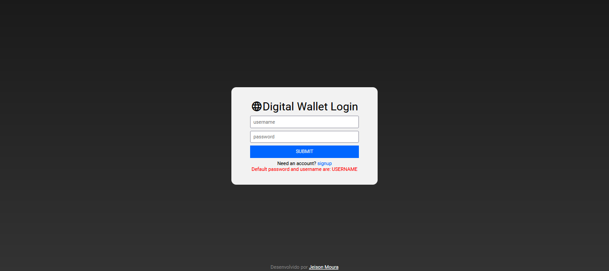
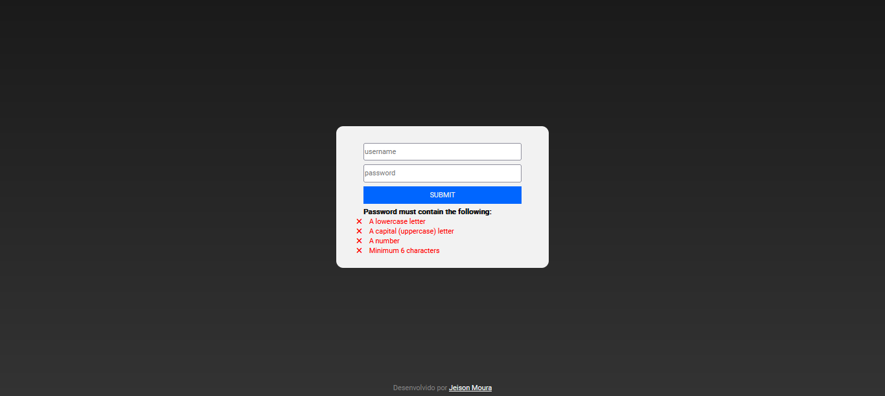
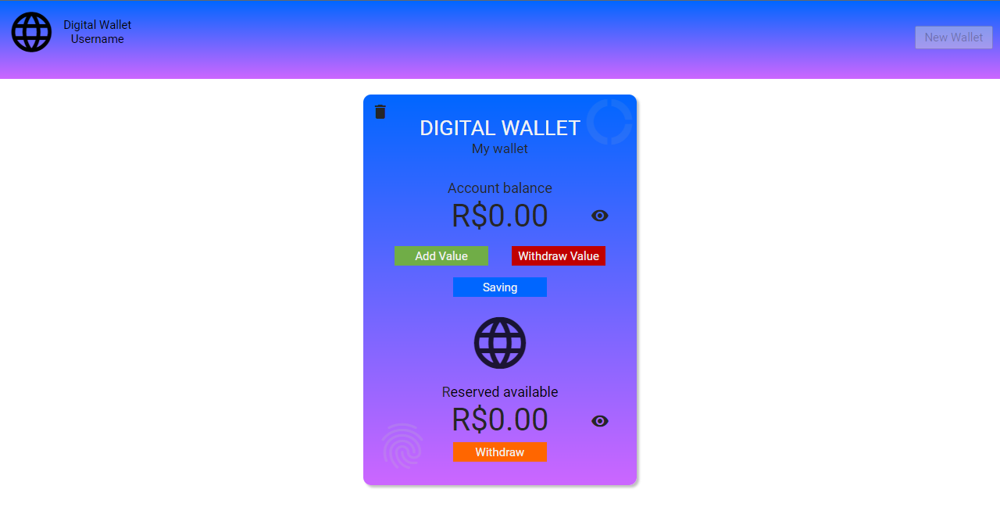

# Digital Wallet 
You can see at: https://jeimoal.github.io/DigitalWallet/ 
 
Digital wallet creation, using HTML / CSS / Javascript: 
 
<b>First screen- Done!</b> 
The first page is the loggin area on the system, where the user and password were set by default. 
A primeira página é a área de loggin no sistema, onde o usuário e a senha foram definidos por padrão. 
 
 
 
<b>New user area - Done!</b> 
New user area, where a new user and password could be created. 
Área de novo usuário, onde poderão ser criados novos usuários e senhas, que serão armazenadas apenas no "localStorage" da máquina. 
 
 
 
<b>Logged area - Done!</b> 
The second page is the area where the user can create a digital wallet.  By clicking a button all html is generated via JavasCript(DOM). 
A segunda página é a área onde o usuário poderá criar uma carteira digital. Ao clicar de um botão, todo o HTML é gerado via JavasCript(DOM). 
 

