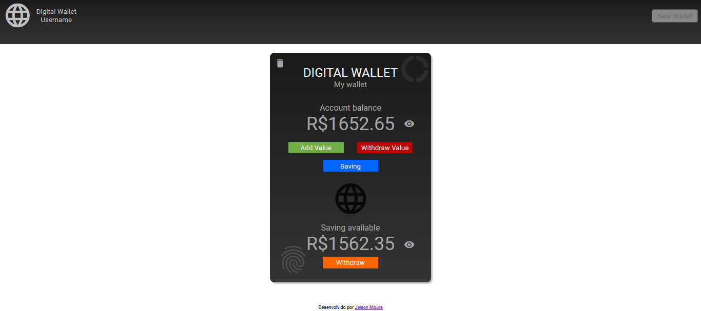

# Digital Wallet 
You can see at: https://jeimoal.github.io/DigitalWallet/ 
 
Digital wallet creation, using HTML / CSS / Javascript: 
 
<b>First screen- Done!</b> 
The first page is the loggin area on the system, where the user and password were set by default. 
A primeira página é a área de loggin no sistema, onde o usuário e a senha foram definidos por padrão. 
 
 
 
<b>New user area - partially done...</b> 
New user area, where a new user and password could be created (cannot be used after creation. BackEnd in progress) 
Área de novo usuário, onde pode ser criado um novo usuário e senha (não pode ser usado após a criação. BackEnd em andamento) 
 
 
<b>Logged area - Done!</b> 
The second page is the area where the user can create a digital wallet.  By clicking a button all html is generated via JavasCript(DOM). 
A segunda página é a área onde o usuário pode criar uma carteira digital. Ao clicar em um botão todo o HTML é gerado via JavasCript(DOM). 
 

What's next: 
* Backend (learning...)
